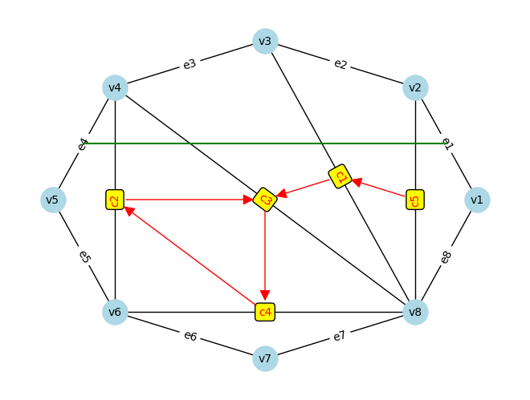

# cluster algebra visualization tool

This library provides a visualization tool for cluster algebras. 
Especially it is useful for visualizing quivers and cluster variables.

## requirements

- python 3.8
- networkx
- matplotlib
- numpy
- scipy

## Installation

```bash
git clone
cd cluster-algebra
pip install -r requirements.txt
```

## Usage

You need vertices, edges(frozens and clusters), laminations(optional) to define a quiver instance. 
After defining a quiver `q`, you can visualize it by calling `q.plot()`. Some options are available to ignore some insignificant vertices or edges.

Further, you can get the exchange matrix of the quiver by calling `q.get_exchange_matrix()`. This matrix also have **shear coordinates** of its lamination.

## Example

You can execute the same example in `test.ipynb`.

* 8 vertices (named by v1, v2, ..., v8)
* 8 frozen edges (named by e1, e2, ..., e8)
* 5 cluster edges (named by c1, c2, ..., c5)
* 1 lamination (from 'e1' to 'e4')


<p style="text-align: center;">quiver diagram</p>

|  | c1 | c2 | c3 | c4 | c5 |
|:----:| :--- | :--- | :--- | :--- | :--- |
| c1 | 0 | 0 | 1 | 0 | -1 |
| c2 | 0 | 0 | 1 | -1 | 0 |
| c3 | -1 | -1 | 0 | 1 | 0 |
| c4 | 0 | 1 | -1 | 0 | 0 |
| c5 | 1 | 0 | 0 | 0 | 0 |
| Shear | 0 | 0 | -1 | 0 | 1 |

<p style="text-align: center;">exchange matrix for above quiver</p>
